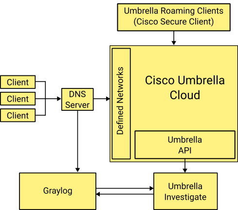

# Umbrella Investigate

This script retrieves potentially harmful DNS-Requests detected/blocked by Cisco Umbrella via the Cisco Umbrella API and pushes the information into Graylog.

Clients using the Cisco Secure Client are clearly identifiable. For request coming from networks that are configured as "Network Identities", the actual clients are not readily identifiable. The script correlates requests logged by Cisco Umbrella with the DNS query logs stored in Graylog.

The script caches seen domains and continues to match later requests made against those domains.



# Installation
## Requirements

The following bits of information are required for the installation:

* Stream ID of DNS client log in Graylog with GIM conformant fields 
* Umbrella API with read-only permissions for Reporting
* TCP/GELF Input, optionally with TLS transport encryption
* A list of the configured Network Identities

## Install the script dependencies 
The script depends on the following python packages:

* Python 3.6 or newer
* requests
* graypy
* python-dateutil

They can be installed with the following command. Do use an virtual environment where appropriate:

```
pip3 install -r requirements.txt
```

## Create the network identities file 

The script needs to know for which requests a search in the Graylog is necessary to resolve the actual client. The requests are labeled with the name of the network identities defined under `Deployments -> Core -> Networks` in the Umbrella Portal.

Create a text file with each line containing the name of one network.


## Create the configuration file

The script is configured by a configuration file.
The following snippet shows the different configuration options that need to be set. File paths are ideally expressed in absolute
terms.

```
[umbrella]
key = <Umbrella API key>
secret = <Umbrella API secret>
timeframe_minutes = <period of retrieved messages in minutes>

[graylog]
token = <Access Token for Graylog API>
api = <Graylog API URL>
dns_log_stream = <Stream ID of the stream containing dns data>

[caching]
cache_file = <path to cache file>
cache_ttl_hours = <life time of cached domains in hours>
log_file = <path for application log file>

[logging]
host = <Graylog Host>
port = <GELF TCP Port>
tls  = <Use TLS? 0=False, 1=True>
#ca_certs = <Path to the CA certificate. Only needed with TLS>
#certfile = <Path to the client certificate. Only needed with TLS>
#keyfile  = <Path to the client key. Only needed with TLS>
```

## Setup a cronjob 

Setup a cronjob that periodically calls the script to check for and ingest new requests. Use the `-c` option to reference your configuration file.
